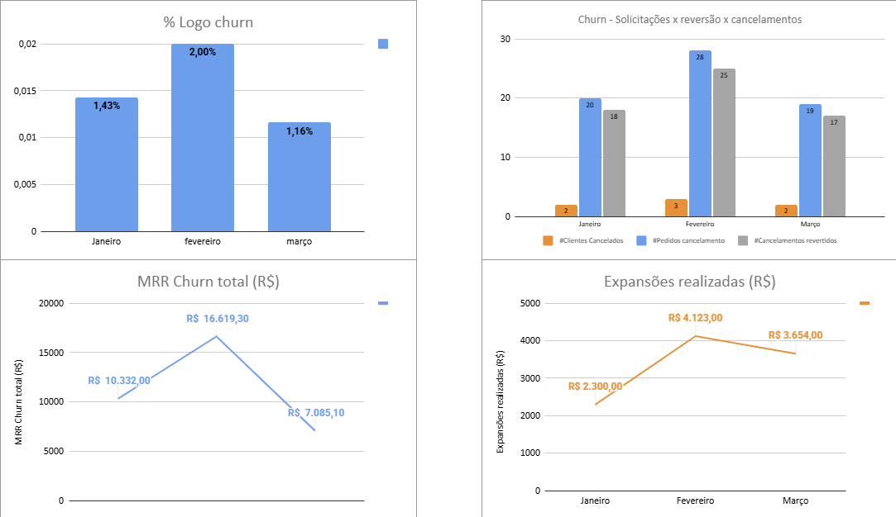

# Análise Estratégica de Churn e Retenção de Clientes

Projeto prático de Customer Success com foco em análise de churn e estratégias de retenção, baseado em cenários reais de gestão de clientes.

## Objetivo
Realizar uma análise de churn para identificar padrões de cancelamento e gerar insights estratégicos de retenção, com base em práticas de Customer Success orientadas a dados.

---

## Ferramentas utilizadas
- Google Sheets  
- Excel  

## Estrutura do projeto
O projeto foi desenvolvido a partir de uma base estruturada de Customer Success, contemplando:

- Base de clientes  
- Classificação de churn  
- Análise de comportamento  
- Identificação de risco  
- Insights estratégicos  
- Plano de ação  

## Análise realizada
A análise considerou os seguintes pontos:

- Clientes ativos vs cancelados  
- Tempo de permanência  
- Nível de engajamento  
- Padrões de comportamento ao longo da jornada  

## 💡 Principais insights
- Clientes com baixa frequência de uso apresentam maior risco de churn, indicando necessidade de atuação preventiva  
- O início da jornada (onboarding) é um momento crítico para retenção  
- A ausência de acompanhamento contínuo impacta diretamente na percepção de valor  
- Clientes sem evolução de uso tendem a cancelar ao longo do tempo  

## 🚀 Plano de ação
Com base nos insights, foram identificadas as seguintes ações estratégicas:

- Estruturação de playbooks de reengajamento  
- Implementação de checkpoints periódicos com clientes  
- Criação de fluxo estruturado de onboarding  
- Monitoramento de clientes em risco (health score)  
- Acompanhamento contínuo da carteira  

## 📈 Impacto no negócio
- A redução do churn impacta diretamente na receita recorrente e no crescimento sustentável  
- Estratégias de retenção são mais eficientes e menos custosas do que aquisição de novos clientes  
- A atuação preventiva aumenta o lifetime value (LTV) da base de clientes  

## Visão geral da análise

## Arquivo do projeto
A análise completa pode ser acessada na planilha disponível neste repositório.

## Observação
Os dados utilizados neste projeto são fictícios ou anonimizados, com o objetivo de preservar a confidencialidade das informações reais.  
A estrutura e o raciocínio refletem cenários reais de análise em Customer Success.

## Sobre mim
Sou profissional com mais de 6 anos de experiência em Customer Success, com foco em retenção, engajamento e crescimento de clientes em ambientes de tecnologia e marketplace.

## Contato
- LinkedIn: https://www.linkedin.com/in/cinthiadiasguimaraes
